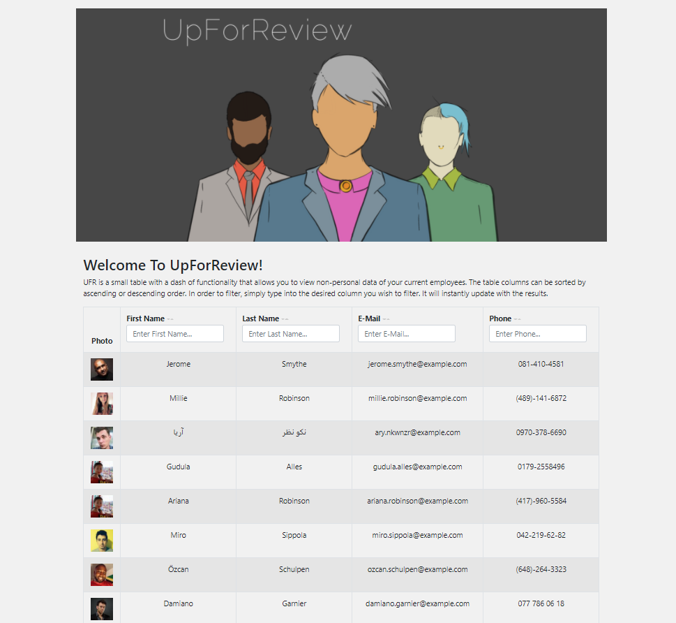

UFR is a small table with a dash of functionality that allows you to view non-personal data of your current employees.

## Table of Contents

* [Description](#description)
* [Usage](#usage)
* [Screenshots](#screenshots)
* [Questions](#questions)

## Description

* Link to the Netlify deployed application - [UpForReview](https://quirky-ritchie-098806.netlify.app/)
* Simple application powered by [Node.js](https://nodejs.org/en/), [React](https://reactjs.org/) , [Axios](https://github.com/axios/axios)
* Built to view employee data
* I created the Hero image - more examples of my artwork `BERTO` (www.robertorubet.com)

## Usage

This employee viewer is simple and straightforward. The table columns can be sorted by `ASCENDING` or `DESCENDING` order. Simply click on the `HEADER` that you wish to sort. In order to filter the view, type into the `INPUT FIELD` of the `COLUMN` you wish to filter. It will instantly update with the results.

## Screenshots

Screenshot of the page

## Questions

Feel free to get in touch with me if you have any questions or concerns.

Link to my GitHub Profile: [Bertodemus](https://github.com/bertodemus)

Email me at: [roberto@robertorubet.com](roberto@robertorubet.com)

